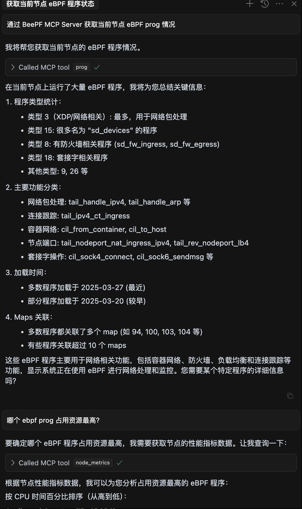

# BeePF MCP Server

基于 Model Context Protocol (MCP) 实现的 BeePF 可观测性接口集成工具。

## 简介

本项目使用 [mark3labs/mcp-go](https://github.com/mark3labs/mcp-go) 框架将 BeePF 项目中的可观测性相关接口转换为 MCP 工具，使大语言模型能够通过 MCP 协议调用这些接口获取系统数据。

## 功能特性

本工具提供了以下 MCP 工具：

- **topo**: 获取系统拓扑信息
- **prog**: 获取节点程序列表
- **prog_detail**: 获取特定节点程序详情（需要 progId 参数）
- **prog_dump**: 获取特定节点程序数据转储（需要 progId 参数）
- **node_metrics**: 获取节点指标数据

## 安装

```bash
# 克隆项目
git clone https://github.com/cen-ngc5139/beepf-mcp.git
cd beepf-mcp

# 安装依赖
go mod tidy

# 构建项目
go build -o beepf-mcp .
```

## 使用方法

### 直接启动

```bash
./beepf-mcp
```

服务器将以标准输入/输出方式启动，可以与支持 MCP 的客户端（例如 [MCPHost](https://github.com/mark3labs/mcphost)）进行交互。

### Cursor 添加 MCP 配置

在 Cursor 的设置中添加 MCP 配置，添加如下配置：

```json
{
  "mcpServers": {
    "BeePF MCP Server": {
      "url": "http://192.168.200.200:8080/sse"
    }
  }
}
```


添加后，在 Cursor 的命令面板中输入 `/tools` 即可看到 MCP 工具列表，选择对应的工具即可使用。


## 示例交互


## 联系与贡献

欢迎提交 Issue 和 Pull Request 来改进此项目。
